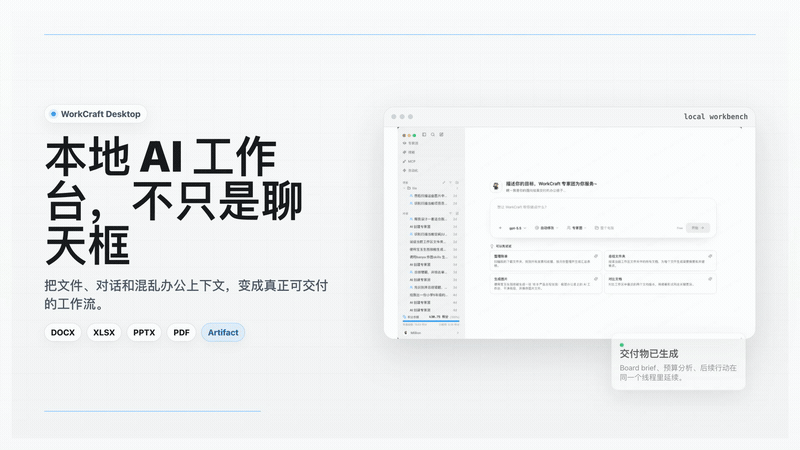
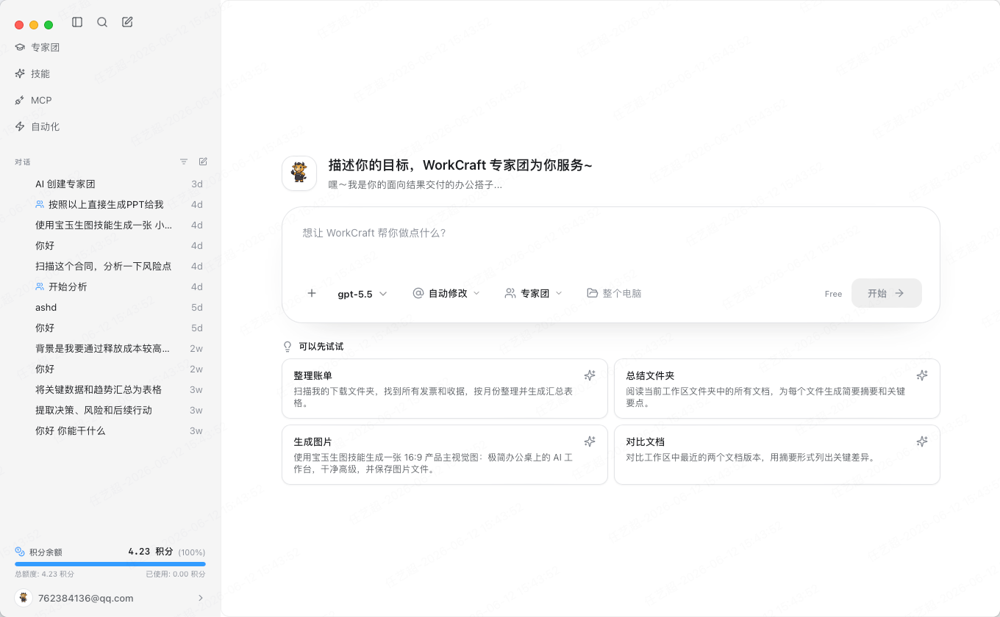
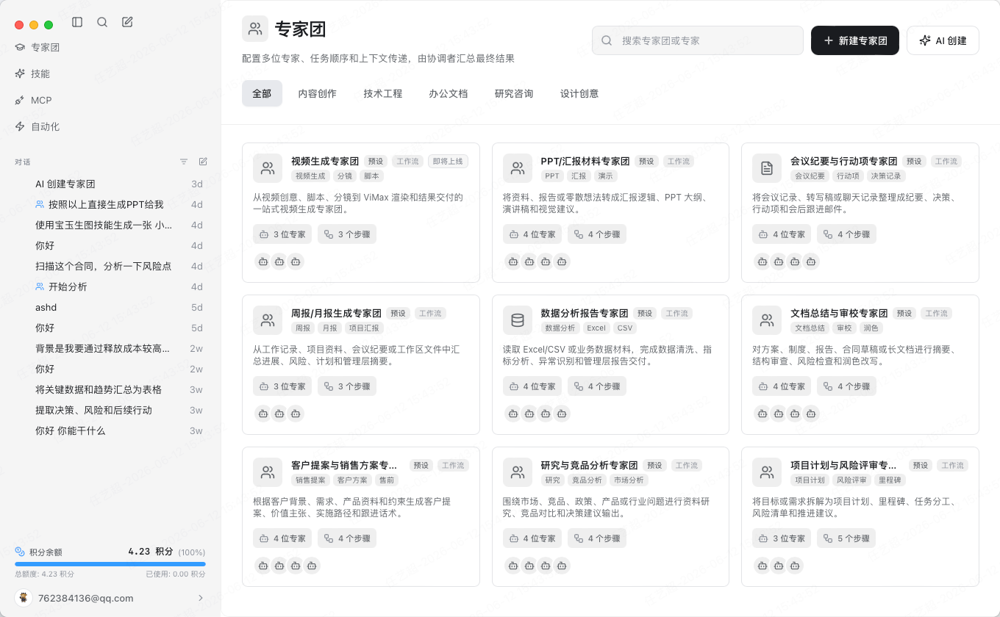
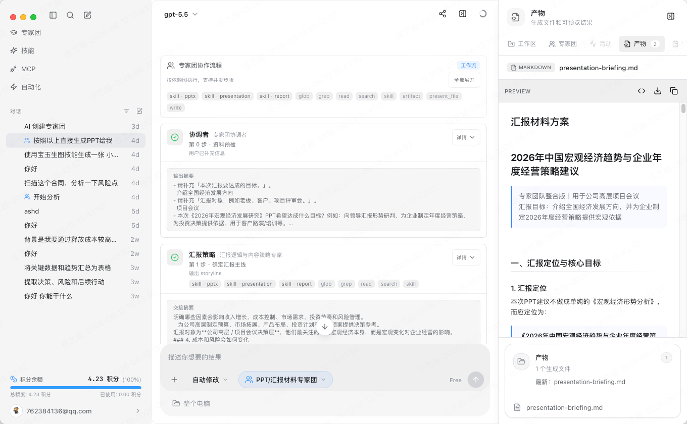
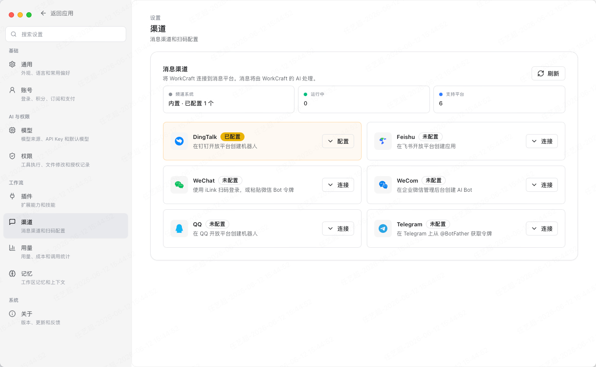
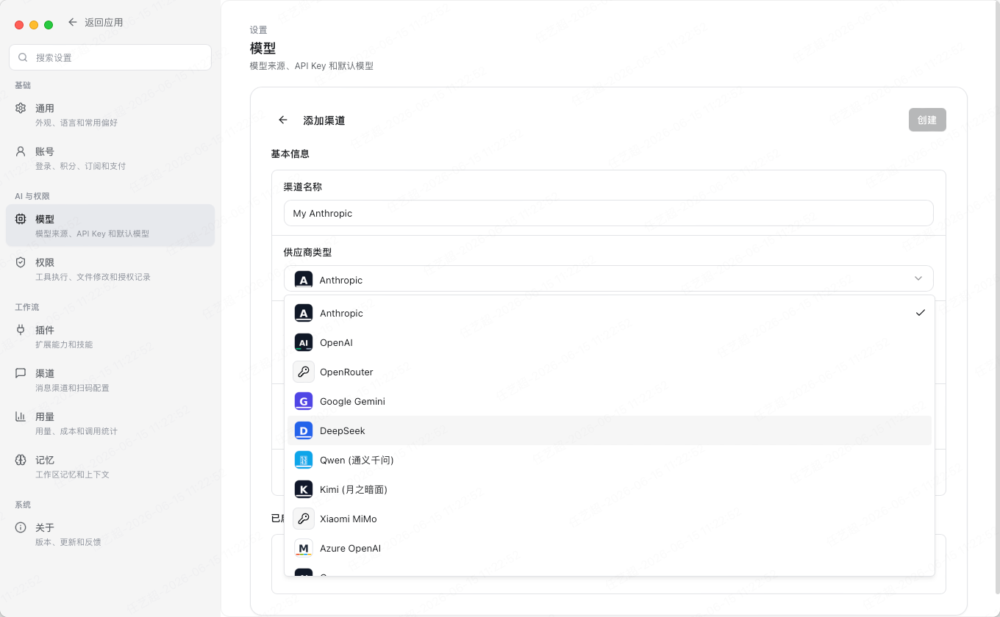

# Codata

<div align="center">
  

  <h3>Local-first desktop AI workspace with expert-team multi-agent collaboration</h3>

  <p>
    <a href="README.zh-CN.md">简体中文</a> ·
    <a href="docs/codata-user-manual.html">User Manual</a> ·
    <a href="docs/codata-office-user-guide.html">Office Guide</a> ·
    <a href="https://example.com/download/">Commercial Download</a> ·
    <a href="LICENSE">Apache-2.0</a>
  </p>

  <p>
    
    
    
    
    
  </p>

  <p>
    
  </p>

  <p><sub>See how expert teams turn real files into reusable artifacts.</sub></p>
</div>

Codata is an open-source desktop AI workbench for people who need AI to work with real files, long-running context, and structured deliverables. It combines a Tauri desktop shell, a Next.js interface, and a FastAPI agent backend so local documents, workspaces, model providers, tools, expert teams, and generated artifacts can live in one application.

Its core idea is simple: a complex request should not be handled by one generic assistant. Codata can route the work through a configurable **expert team** where specialized agents research, analyze, write, review, delegate, and produce a final deliverable together.

### Open Source - Local First - Bring Your Own Models - Expert Teams

- **Expert-team multi-agent workflows**: define specialist members, task dependencies, context handoff rules, and final deliverables.
- **Three collaboration modes**: sequential execution, DAG-style workflow execution, and hierarchical manager delegation.
- **File-grounded desktop work**: read, search, summarize, transform, and generate artifacts from local project and office files.
- **BYOK model routing**: connect your own provider keys, OpenAI-compatible endpoints, custom endpoints, or local Ollama models.
- **MCP, tools, skills, and plugins**: extend agents with controlled capabilities for files, code, search, connectors, and domain workflows.
- **Local persistence by default**: conversations, files, settings, memory, workflow metadata, and artifacts are stored locally unless you choose an external provider or connector.
- **Commercial and enterprise options**: same core product capabilities, with Codata-managed sign-in, more stable managed models such as GPT-5.5, cost-effective GPT access options, and enterprise SSO, audit, model, and private deployment support.

<details>
<summary><kbd>Table of Contents</kbd></summary>

- [What Codata Does](#what-codata-does)
- [Product Tour](#product-tour)
- [Contact](#contact)
- [Expert Teams](#expert-teams)
- [Key Features](#key-features)
- [Use Cases](#use-cases)
- [Model Support](#model-support)
- [Editions](#editions)
- [Architecture](#architecture)
- [Quick Start](#quick-start)
- [Development Commands](#development-commands)
- [Repository Layout](#repository-layout)
- [Data Boundary](#data-boundary)
- [Documentation](#documentation)
- [Contributing](#contributing)
- [License](#license)

</details>

## What Codata Does

Codata is built for document-heavy and workflow-heavy AI tasks:

- Load local files and workspace folders into AI conversations.
- Let agents inspect documents, spreadsheets, PDFs, code, and generated artifacts.
- Track task activity, tool calls, plans, intermediate outputs, and final files.
- Create reusable expert teams for recurring business, research, writing, analysis, and engineering workflows.
- Keep model choice under user control instead of requiring a hosted service login.

The open-source edition is designed as a standalone local application. Users provide their own model access and decide which cloud providers, local models, or external connectors are allowed.

## Product Tour

Codata is built around visible work: agents read files, coordinate through expert-team workflows, and turn intermediate reasoning into concrete artifacts that can be reviewed, downloaded, and reused.

| Workspace home | Expert team library |
| --- | --- |
|  |  |

| Expert workflow and artifact preview | Message channel setup |
| --- | --- |
|  |  |

| Skills and connectors | Model provider setup |
| --- | --- |
|  |  |

## Contact

Security and project contact: [codata@126.com](mailto:codata@126.com)

| Feedback WeChat | WeChat community group |
| --- | --- |
|  |  |

## Expert Teams

Expert Teams are the main Codata differentiator. A team is a typed configuration that describes who participates, how work is split, what context each member receives, and what final result should be delivered.

An expert team can include:

- **Members**: role, goal, backstory, model/provider override, temperature, tools, skills, MCP connectors, icon, and display metadata.
- **Tasks**: task prompt, expected output, assigned member, dependencies, output variable, context policy, retry count, timeout, conditions, and loops.
- **Inputs**: structured fields collected before a run, such as report goal, market, competitors, metric focus, or reporting period.
- **Finalization**: coordinator summary, last-task output, or required deliverables such as Markdown, HTML, PDF, DOCX, XLSX, PPTX, code, image, video, or artifact panel output.

Codata supports three execution modes:

| Mode | Best for | How it works |
| --- | --- | --- |
| `sequential` | Linear work such as draft -> review -> polish | Runs tasks in order, adding implicit dependencies when needed. |
| `workflow` | Fixed processes with dependencies and possible parallelism | Builds a DAG, runs dependency-ready tasks, passes upstream outputs through templates such as `{{research_findings}}`. |
| `hierarchical` | Open-ended work that needs judgment while running | A manager agent delegates work to coworker experts with `delegate_work`, asks follow-up questions with `ask_coworker`, then synthesizes the answer. |

Built-in presets include data analysis reports, document review and polish, meeting notes and action items, presentation briefing, project planning and risk review, research and competitive analysis, sales proposals, video production, and weekly/monthly reports.

## Key Features

### Multi-agent expert workforce

Codata lets you build a reusable AI workforce for specific job types. Each expert can have its own role prompt, provider/model selection, tool access, skills, and connector permissions. Complex work becomes observable: users can inspect who did what, which dependency fed the next step, and what artifact was produced.

### File and artifact workflow

Codata is not just a chat window. It can read and reason over DOCX, XLSX, PPTX, PDF, CSV, local project files, and generated outputs. Results can be surfaced as Markdown, HTML, office documents, tables, code, previews, or artifact panel entries.

### Tool execution with boundaries

Agents can use file tools, search tools, code execution, artifact creation, MCP connectors, and plugin-provided capabilities. Workflows can keep capabilities scoped to the expert that needs them, instead of exposing every tool to every agent.

### Local-first desktop runtime

The desktop app runs a local backend for sessions, streaming, file parsing, tool execution, persistence, and provider routing. Cloud calls happen only when a configured cloud model or external connector is selected.

### Extensible automation surface

The codebase includes support for plugins, bundled skills, MCP connectors, scheduled automations, workspace memory, remote access surfaces, and messaging channels where configured.

## Use Cases

- **Research and competitive analysis**: collect sources, compare competitors, identify risks, and deliver a structured report.
- **Data and business reporting**: read Excel/CSV files, profile fields, analyze metrics, find anomalies, and generate management summaries.
- **Document review and writing**: split drafting, review, fact checking, tone adjustment, and final editing across multiple specialists.
- **Meeting follow-up**: turn transcripts or notes into decisions, action items, owners, timelines, and follow-up drafts.
- **Project planning and risk review**: let product, engineering, market, finance, and risk experts inspect a plan from different angles.
- **Engineering workbench**: inspect local projects, summarize requirements, generate implementation plans, and produce code or documentation artifacts.

## Model Support

Codata open source uses a bring-your-own-model setup:

- OpenAI-compatible endpoints and custom endpoints.
- OpenRouter and direct provider adapters where configured.
- Anthropic, Gemini, and other provider routes available through the provider layer.
- Local Ollama models for local-first or reduced-cloud workflows.
- Per-expert provider/model overrides for teams that need different cost, latency, or reasoning profiles.

Model calls require a configured provider route or local model. The open-source flow runs without a Codata-hosted login.

## Editions

The open-source, commercial, and enterprise editions share the same core product capabilities: expert-team multi-agent workflows, local file workspaces, artifact delivery, provider routing, MCP/tool integration, plugins, automation, and the desktop app architecture.

| Edition | Best for | What it includes |
| --- | --- | --- |
| Open source | Developers and teams that want full local control | BYOK provider setup, OpenAI-compatible endpoints, custom endpoints, local Ollama models, local persistence, and the Apache-2.0 open-source codebase. |
| Commercial | Users who want the same Codata experience with simpler onboarding | Same product capabilities as open source, Codata-managed sign-in, more stable managed model routes such as GPT-5.5, and more cost-effective GPT access options. Download from the official site: [example.com/download](https://example.com/download/). |
| Enterprise | Organizations that need governance, integration, and deployment control | SSO login, audit support, enterprise-grade model options, private deployment, and custom solution services. Contact dedicated support through the official site for enterprise planning. |

Choose the open-source edition if you want to run Codata entirely with your own model providers and local configuration. Choose the commercial or enterprise edition when you need managed onboarding, stable model access, lower GPT usage cost options, or organization-level support.

## Architecture

```text
User
  -> Tauri desktop shell
  -> Next.js frontend
  -> FastAPI backend
  -> agent runtime, expert teams, tools, storage, providers, connectors
```

- **Tauri desktop shell**: native packaging, desktop permissions, updater integration, bundled resources, and platform-specific behavior.
- **Next.js frontend**: chat, expert teams, artifacts, activity, settings, provider setup, memory, plugins, automation, and workspace panels.
- **FastAPI backend**: agent loop, resumable SSE streaming, expert-team execution, file parsing, tool execution, SQLite persistence, provider adapters, MCP integration, memory extraction, and scheduled jobs.

## Quick Start

### Prerequisites

- Node.js 20 or newer.
- Python 3.12 or newer.
- Rust and Cargo for Tauri desktop builds.
- Platform-specific Tauri prerequisites for macOS, Windows, or Linux.
- A configured model provider key, OpenAI-compatible endpoint, custom endpoint, or local Ollama model for real AI calls.

### Install dependencies

```bash
git clone https://github.com/Mlilion/Codata.git
cd codata

npm install
cd frontend && npm install --legacy-peer-deps
cd ..

cd backend
python3.12 -m venv venv
./venv/bin/pip install -e ".[dev]"
cd ..
```

### Run the development stack

```bash
npm run dev:all
```

The frontend development server uses port `3000`. The backend development server uses port `8000`. Desktop development starts the Tauri shell against the local frontend and backend stack.

## Development Commands

```bash
npm run dev:frontend
npm run dev:backend
npm run dev:desktop

npm run build:frontend
npm run build:backend
npm run sync:desktop-meta
npm run build:desktop
```

Verification commands:

```bash
npm run verify:open-source-boundary
npm run verify:frontend-assets
npm run preflight:ui
```

The desktop release build expects the exported frontend in `frontend/out` and the bundled backend in `backend/dist/codata-backend`. Run `npm run sync:desktop-meta` before desktop builds so Tauri metadata matches the root package version.

## Repository Layout

```text
desktop-tauri/    Tauri v2 desktop shell and Rust integration
frontend/         Next.js UI for chat, expert teams, settings, artifacts, and desktop screens
backend/          FastAPI backend, agent runtime, expert-team orchestration, storage, and providers
scripts/          Build, release, verification, signing, and version utilities
docs/             User manuals
design-system/    Product design references and design assets
```

## Data Boundary

Codata stores user data locally by default, including conversations, files, generated artifacts, settings, memory, and workflow metadata. When a cloud model or external connector is selected, Codata sends the prompt context and required payload to that provider or connector.

Users are responsible for selecting provider routes, local models, connector permissions, and deployment settings that match their security, privacy, and compliance needs.

## Documentation

- [Codata User Manual](docs/codata-user-manual.html)
- [Codata Office Guide](docs/codata-office-user-guide.html)
- [Security Policy](SECURITY.md)

## Contributing

Focused issues and pull requests are welcome. For this open-source edition, keep changes aligned with the local-first and BYOK boundaries: do not reintroduce hosted login, proxy-provider, or paid-only assumptions into the open-source flow.

Before opening a PR, run the relevant verification commands for the area you changed.

## License

Codata is licensed under the Apache License, Version 2.0. See [LICENSE](LICENSE).
