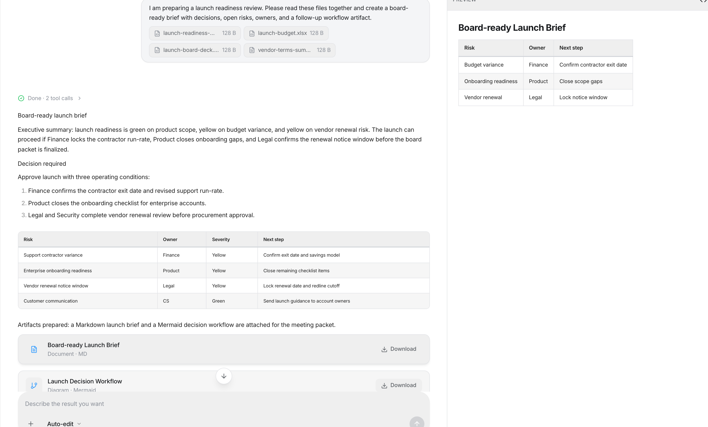
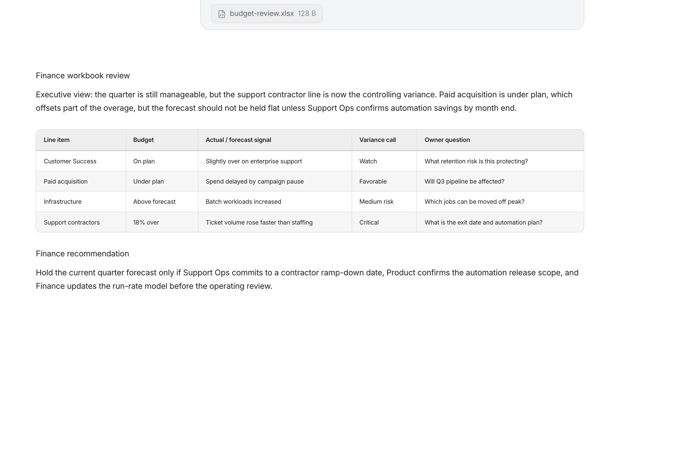
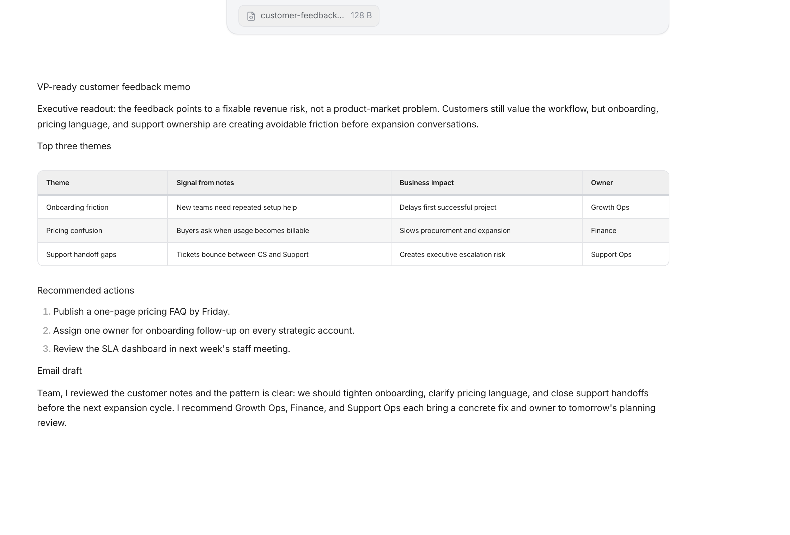
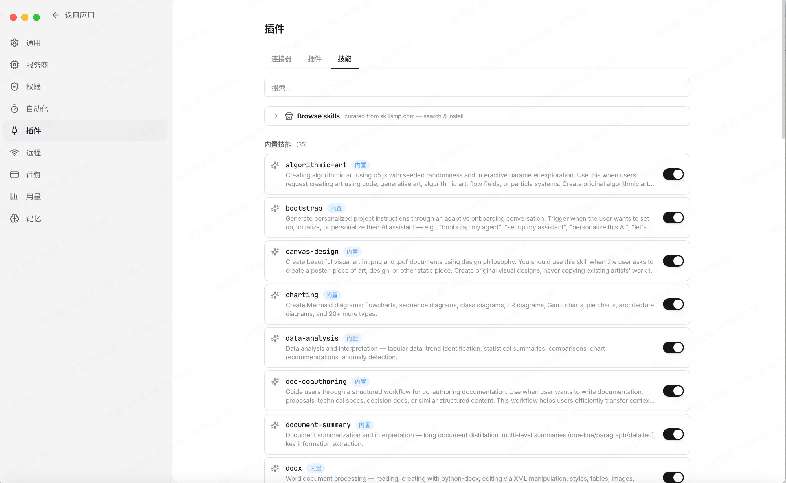
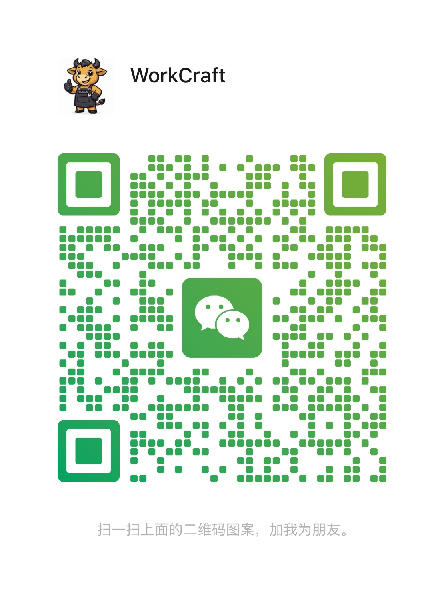

# WorkCraft

<div align="center">
  

  <h3>本地优先的桌面 AI 工作台，核心能力是专家团多 Agent 协作</h3>

  <p>
    <a href="README.md">English</a> ·
    <a href="docs/workcraft-user-manual.html">用户手册</a> ·
    <a href="docs/workcraft-office-user-guide.html">办公指南</a> ·
    <a href="https://work-craft.com/download/">商业版下载</a> ·
    <a href="LICENSE">Apache-2.0</a>
  </p>

  <p>
    
    
    
    
    
  </p>

  <p>
    
  </p>

  <p>
    <a href="docs/assets/readme/workcraft-product-intro-2026-v2.mp4">下载 MP4 产品视频</a>
  </p>

  <p><sub>了解专家团如何把真实文件转成可复用交付物。</sub></p>
</div>

WorkCraft 是一个开源桌面 AI 工作台，面向真实文件、长上下文任务和结构化交付物。它把 Tauri 桌面外壳、Next.js 交互界面和 FastAPI Agent 后端组合在一起，让本地文档、工作区、模型提供商、工具、专家团和生成产物都在一个应用里协同工作。

WorkCraft 的核心判断是：复杂任务不应该只交给一个通用助手。它可以把任务交给可配置的 **专家团**，让多个专业 Agent 按角色分工完成研究、分析、写作、审阅、委派和最终交付。

### 开源 - 本地优先 - 自带模型 - 专家团协作

- **专家团多 Agent 工作流**：定义专家成员、任务依赖、上下文交接规则和最终交付物。
- **三种协作模式**：顺序执行、DAG 工作流执行、Hierarchical Manager 统筹委派。
- **围绕文件的桌面工作台**：读取、搜索、总结、转换本地项目文件和办公文件，并生成可复用产物。
- **BYOK 模型路由**：接入自己的模型厂商 API Key、OpenAI-compatible endpoint、自定义端点或本地 Ollama 模型。
- **MCP、工具、技能与插件**：为 Agent 增加受控的文件、代码、搜索、连接器和领域流程能力。
- **默认本地持久化**：对话、文件、设置、记忆、工作流元数据和生成产物默认保存在本机；只有用户选择外部模型或连接器时才发送必要上下文。
- **提供商业版和企业版**：核心产品能力与开源版一致；商业版保留 WorkCraft 独立登录能力，提供 GPT-5.5 等更稳定的托管模型和更优惠的 GPT 调用方案；企业版支持 SSO、审计、企业级模型和私有化方案定制。

<details>
<summary><kbd>目录</kbd></summary>

- [WorkCraft 是做什么的](#workcraft-是做什么的)
- [产品展示](#产品展示)
- [专家团](#专家团)
- [核心能力](#核心能力)
- [典型场景](#典型场景)
- [模型支持](#模型支持)
- [版本选择](#版本选择)
- [技术架构](#技术架构)
- [快速开始](#快速开始)
- [开发命令](#开发命令)
- [仓库结构](#仓库结构)
- [数据边界](#数据边界)
- [文档](#文档)
- [参与贡献](#参与贡献)
- [许可证](#许可证)
- [联系](#联系)

</details>

## WorkCraft 是做什么的

WorkCraft 面向文档密集、流程密集的 AI 工作：

- 把本地文件和工作区文件夹加入 AI 会话。
- 让 Agent 检查文档、表格、PDF、代码和生成产物。
- 跟踪任务活动、工具调用、计划、中间输出和最终文件。
- 为重复的业务、研究、写作、分析和工程任务创建可复用专家团。
- 让用户自己控制模型来源，而不是依赖托管登录体系。

开源版定位是独立的本地应用。用户自行提供模型访问，并决定允许使用哪些云端模型、本地模型或外部连接器。

## 产品展示

WorkCraft 强调“看得见的工作过程”：Agent 可以读取真实文件，通过专家团协作完成中间步骤，并把结果沉淀为可预览、可下载、可复用的 artifact。

| 文件驱动的产物交付 | 表格与预算分析 |
| --- | --- |
|  |  |

| 文档简报生成 | 技能与连接器 |
| --- | --- |
|  |  |

## 专家团

专家团是 WorkCraft 最核心的差异化能力。一个专家团是一份结构化配置，描述谁参与、任务如何拆分、每个成员接收哪些上下文，以及最终结果如何交付。

一个专家团可以包含：

- **专家成员**：角色、目标、背景、模型/provider 覆盖、temperature、工具、技能、MCP 连接器、图标和展示信息。
- **任务节点**：任务提示词、期望输出、负责成员、依赖关系、输出变量、上下文策略、重试次数、超时、条件和循环。
- **输入项**：运行前收集的结构化字段，例如报告目标、目标市场、竞品、指标重点、报告周期。
- **最终交付**：协调者总结、最后任务输出，或 Markdown、HTML、PDF、DOCX、XLSX、PPTX、代码、图片、视频、artifact 面板等交付物。

WorkCraft 支持三种执行模式：

| 模式 | 适合场景 | 工作方式 |
| --- | --- | --- |
| `sequential` | 草稿 -> 审阅 -> 润色这类线性流程 | 按任务顺序执行；必要时自动补充上一步依赖。 |
| `workflow` | 步骤固定、有依赖关系、部分任务可并行的流程 | 构建 DAG，运行依赖已满足的任务，并通过 `{{research_findings}}` 这类变量传递上游输出。 |
| `hierarchical` | 开放复杂、需要运行时判断的任务 | Manager Agent 使用 `delegate_work` 委派专家，用 `ask_coworker` 追问专家，最后综合输出。 |

内置预设包括数据分析报告、文档审阅润色、会议纪要行动项、PPT 汇报简报、项目计划与风险评审、研究与竞品分析、销售方案、视频制作、周报/月报等专家团。

## 核心能力

### 多 Agent 专家团队

WorkCraft 可以为特定任务类型构建可复用的 AI 专家团队。每个专家都能有自己的角色提示词、provider/model 选择、工具权限、技能和连接器权限。复杂任务的过程是可观察的：用户可以看到谁完成了哪一步、哪个上游结果进入了下一步、最终产物从哪里生成。

### 文件与产物工作流

WorkCraft 不只是聊天窗口。它可以读取并理解 DOCX、XLSX、PPTX、PDF、CSV、本地项目文件和生成产物。结果可以作为 Markdown、HTML、办公文档、表格、代码、预览或 artifact 面板条目交付。

### 带边界的工具执行

Agent 可以使用文件工具、搜索工具、代码执行、artifact 创建、MCP 连接器和插件能力。专家团可以把能力只分配给需要它的专家，而不是把所有工具暴露给所有 Agent。

### 本地优先桌面运行时

桌面端运行本机后端，负责会话、流式输出、文件解析、工具执行、持久化和模型路由。只有当用户选择云端模型或外部连接器时，才会产生对应外部请求。

### 可扩展自动化

代码库包含插件、内置技能、MCP 连接器、定时自动化、工作区记忆、远程访问界面和消息渠道等扩展能力，按配置启用。

## 典型场景

- **研究与竞品分析**：收集资料、对比竞品、识别风险，并交付结构化研究报告。
- **数据与经营报告**：读取 Excel/CSV，检查字段，分析指标，发现异常，生成管理层摘要。
- **文档审阅与写作**：把起草、审阅、事实检查、语气调整和最终编辑分给不同专家。
- **会议跟进**：把录音转写或会议纪要转成决策、行动项、负责人、截止日期和跟进邮件。
- **项目计划与风险评审**：让产品、工程、市场、财务、风险等角色从不同角度检查方案。
- **工程工作台**：检查本地项目，梳理需求，生成实现计划，并产出代码或文档 artifact。

## 模型支持

WorkCraft 开源版采用用户自带模型的方式：

- OpenAI-compatible endpoint 和自定义端点。
- OpenRouter 以及已配置的直接 provider adapter。
- Anthropic、Gemini 等通过 provider 层接入的模型路径。
- 本地 Ollama 模型，适合本地优先或减少云端调用的任务。
- 专家团成员可以单独指定 provider/model，用不同成本、延迟和推理能力完成不同步骤。

模型调用需要配置可用的 provider 路径或本地模型。开源版流程不需要 WorkCraft 托管登录。

## 版本选择

开源版、商业版和企业版的核心产品能力一致：专家团多 Agent 工作流、本地文件工作区、artifact 交付、provider 路由、MCP/工具集成、插件、自动化和桌面应用架构。

| 版本 | 适合对象 | 包含能力 |
| --- | --- | --- |
| 开源版 | 希望完全掌控本地配置和模型来源的开发者与团队 | BYOK 模型配置、OpenAI-compatible endpoint、自定义端点、本地 Ollama、本地持久化，以及 Apache-2.0 开源代码。 |
| 商业版 | 希望开箱即用、减少模型配置成本的用户 | 与开源版相同的核心产品能力，保留 WorkCraft 独立登录能力，提供 GPT-5.5 等更稳定的托管模型路线，以及更优惠的 GPT 模型调用方案。商业版可在官网下载：[work-craft.com/download](https://work-craft.com/download/)。 |
| 企业版 | 需要统一身份、治理审计、企业模型和部署控制的组织 | SSO 登录、审计支持、企业级模型、私有化部署和解决方案定制。企业用户可通过官网联系专属客服，获取部署与方案规划支持。 |

如果你希望完全使用自己的模型厂商、OpenAI 兼容端点、自定义端点或本地 Ollama，建议使用开源版。如果你需要托管登录、稳定模型、更优惠的 GPT 调用成本或企业级支持，可以选择商业版或企业版。

## 技术架构

```text
User
  -> Tauri desktop shell
  -> Next.js frontend
  -> FastAPI backend
  -> agent runtime, expert teams, tools, storage, providers, connectors
```

- **Tauri 桌面外壳**：原生打包、桌面权限、updater 集成、打包资源和平台相关行为。
- **Next.js 前端**：聊天、专家团、artifact、activity、设置、provider 配置、记忆、插件、自动化和工作区面板。
- **FastAPI 后端**：Agent loop、可恢复 SSE 流、专家团执行、文件解析、工具执行、SQLite 持久化、provider adapter、MCP 集成、记忆抽取和定时任务。

## 快速开始

### 环境要求

- Node.js 20 或更新版本。
- Python 3.12 或更新版本。
- Rust 和 Cargo，用于 Tauri 桌面构建。
- macOS、Windows 或 Linux 对应的 Tauri 平台依赖。
- 真实 AI 调用需要配置模型 provider key、OpenAI-compatible endpoint、自定义端点或本地 Ollama 模型。

### 安装依赖

```bash
git clone https://github.com/Mlilion/workcraft.git
cd workcraft

npm install
cd frontend && npm install --legacy-peer-deps
cd ..

cd backend
python3.12 -m venv venv
./venv/bin/pip install -e ".[dev]"
cd ..
```

### 启动开发栈

```bash
npm run dev:all
```

前端开发服务器使用 `3000` 端口，后端开发服务器使用 `8000` 端口。桌面开发会启动 Tauri 外壳并连接本地前端和后端栈。

## 开发命令

```bash
npm run dev:frontend
npm run dev:backend
npm run dev:desktop

npm run build:frontend
npm run build:backend
npm run sync:desktop-meta
npm run build:desktop
```

验证命令：

```bash
npm run verify:open-source-boundary
npm run verify:frontend-assets
npm run preflight:ui
```

桌面发布构建依赖 `frontend/out` 中导出的前端静态资源，以及 `backend/dist/workcraft-backend` 中的后端 bundle。桌面构建前运行 `npm run sync:desktop-meta`，确保 Tauri metadata 与根 package 版本一致。

## 仓库结构

```text
desktop-tauri/    Tauri v2 桌面外壳与 Rust 集成
frontend/         Next.js UI，包含聊天、专家团、设置、artifact 和桌面界面
backend/          FastAPI 后端、Agent runtime、专家团编排、存储和 provider 层
scripts/          构建、发布、验证、签名和版本工具
docs/             用户手册
design-system/    产品设计参考和设计资产
```

## 数据边界

WorkCraft 默认在本地存储用户数据，包括对话、文件、生成产物、设置、记忆和工作流元数据。当用户选择云端模型或外部连接器时，WorkCraft 会把 prompt 上下文和必要 payload 发送给对应 provider 或 connector。

用户需要自行选择符合安全、隐私和合规要求的 provider 路径、本地模型、连接器权限和部署设置。

## 文档

- [WorkCraft 用户手册](docs/workcraft-user-manual.html)
- [WorkCraft 办公指南](docs/workcraft-office-user-guide.html)
- [安全策略](SECURITY.md)

## 参与贡献

欢迎提交聚焦的问题和 Pull Request。对于开源版，请保持本地优先和 BYOK 边界：不要把托管登录、代理 provider 或付费专属假设重新引入开源流程。

提交 PR 前，请根据修改范围运行对应验证命令。

## 许可证

WorkCraft 使用 Apache License, Version 2.0 开源。请见 [LICENSE](LICENSE)。

## 联系

安全与项目联系邮箱：[workcraft@126.com](mailto:workcraft@126.com)

反馈微信：


